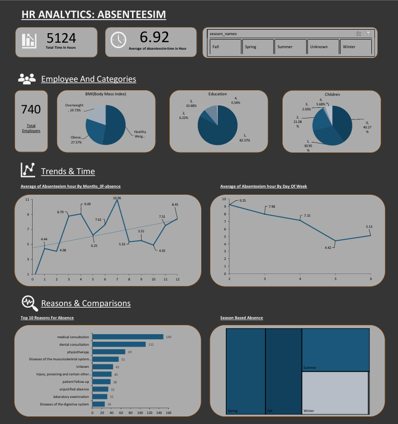

# 📉HR Analytics-Absenteeism at Work 
## Problem Statement: 🔍 
HR Request to Data Analysis Team To provide a list of healthy individuals with low absenteeism for our healthy bonus program. The program's total budget is $1000 USD.  

➢ Please calculate the wage increase or annual compensation for 
nonsmokers, using an insurance budget of $983,221 for all non
smokers.  
➢ Lastly, create a dashboard for HR to understand absenteeism at work, 
based on the approved wireframe. 

## Approach:-   
1. Understanding Data Analysis Task and Problem Statement  
2. Connecting to Postgres SQL Server and Database/Table Creation  
3. Uploading Data to the Database  
4. Writing SQL Complex Join Queries  
5. SQL Query with Filters for Healthy Workers  
6. Compensation Calculation Analysis with SQL  
7. Optimize SQL Query and CASE Statements  
8. Connecting Excel [Power Pivot/Power Query] to Database Postgres SQL  
9. Dashboard Development and Wireframe  
10. Final Dashboard Design  

## Tool used-  
SQL (Postgres SQL), Advance Excel (Power Query, Power Pivot, Dashboard, 
Pivot Tables) 

## Joining tables through queries. 
```sql SELECT *
FROM absenteeism_at_work ab
LEFT JOIN compensation co 
        ON ab.id=co.id
LEFT JOIN reasons re 
        ON ab.reason_for_absence=re.number  
```
# Insights 👎  
### Q1. To provide a list of healthy individuals with low absenteeism for our healthy bonus program. The program's total budget is $1000 USD.  

### Solution:- 🔍

Based on the SQL query, we have determined that there are 111 employers who 
meet multiple criteria and are considered to be healthy with low absenteeism. We 
can offer them bonus incentives from our fixed budget to show our apprciation.         
```sql
SELECT *
FROM 
    absenteeism_at_work ab    
WHERE ab.disciplinary_failure = FALSE 
        AND ab.social_drinker= FALSE AND ab.social_smoker= FALSE 
        AND ab.body_mass_index < 25 
        AND ab.absenteeism_time_in_hours <= (SELECT 
                        ROUND(Avg(ab.absenteeism_time_in_hours))
FROm absenteeism_at_work ab
)
```
### Q2. Please calculate the wage increase or annual compensation for nonsmokers, using an insurance budget of $983,221 for all non-smokers.  
### Solution:-  
The compensation rate increase for non-smokers by 0.68 increase per hour 
which means  
$1,414.4/year.  
```sql
SELECT COUNT(ab.id)
FROM absenteeism_at_work ab
WHERE ab.social_smoker = FALSE
```
> ### COUNT= 686

To calculate the wage increase or annual compensation for non-smokers, using 
an insurance budget of $983,221 for all non-smokers, we can use the following 
steps:  
5days * 8hr = 40hr/day. it means in 52 week(1 yr) 40 hr *52 = 2080 hr  
1. Calculate the total number of hours worked by all employees:  
2080hr *686 = 1,426,880 hrs  
2. Divide the total number of hours worked by the insurance budget to get the hourly compensation rate increase:  
1,426,880 \ $983,221 = 0.68$/hr  
3. Finally, multiply the hourly compensation rate increase by the number of hours worked per year (2080) to get the annual compensation increase:  

0.68 $ * 2080 hrs = $1,414.4/yr  
Therefore, the annual compensation increase for non-smokers is $1,414.4yr
# Data Processing And Query Optimization for Dashboard Prepration 
```sql
CREATE VIEW absenteeism_at_work_fact AS
SELECT
    ab.id,
    ab.body_mass_index,
    CASE 
    When Body_mass_index <18.5 then 'Underweight'
    When Body_mass_index between 18.5 and 25 then 'Healthy Weight'
    When Body_mass_index between 25 and 30 then 'Overweight'
    When Body_mass_index > 30 then 'Obese'
    Else 'Unknown'
    END as BMI_category,
    CASE
    WHEN Month_of_absence in (12,1,2) then 'Winter'
    WHEN Month_of_absence in (3,4,5) then 'Spring'
    WHEN Month_of_absence in (6,7,8) then 'Summer'
    WHEN Month_of_absence in (9,10,11) then 'Fall'
    else 'Unknown'
    end as Season_names,
    ab.seasons,
    co.comp_per_hr,
    re.reason,
    ab.month_of_absence,
    -- ab.reason_for_absence,
    ab.day_of_the_week,
    ab.age,
    ab.disciplinary_failure,
    ab.education,
    ab.son,
    ab.social_drinker,
    ab.social_smoker,
    ab.absenteeism_time_in_hours
FROM absenteeism_at_work ab
LEFT JOIN compensation co ON ab.id=co.id
LEFT JOIN reasons re ON ab.reason_for_absence=re.number
```
# Dashboard

